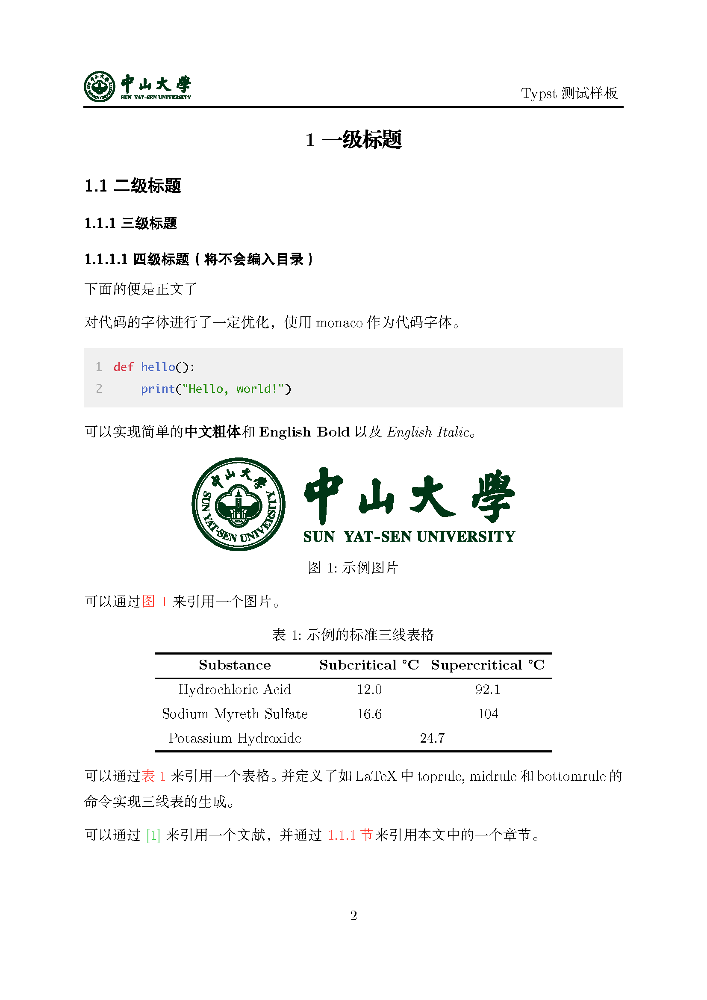

# SYSU-Report-Typst

 

适用于中山大学的一个简单的，自己正在使用的**Typst**报告模板。当然这**不能**适用于学位论文等正式论文的编写，但是对于小型的报告还是非常适用的。

本仓库相同的模板还有几乎一模一样的**LaTeX**的版本！详见[SYSU-Report-LaTeX](https://github.com/lankoestee/sysu-report-latex)。

该模板也是本人报告写作方法的一部分，详见[舒适写作大法 | 大聪明de小妙招 (cleversmall.com)](https://cleversmall.com/posts/e06f63c1/)。

## 快速使用

```bash
git clone https://github.com/lankoestee/sysu-report-typst
```

克隆后，直接编辑里面的`report.typ`。里面包括了一些`founder.typ`模板文件的预制变量，可以根据自己的需求进行修改。

当然对于不是中山大学的使用者而言，你可以修改`figure/badge.svg`为自己学校或单位的正方形图标，修改`figure/badge-horizonal.svg`为自己学校或单位的长方形图标。

> [!TIP]
> 本仓库中的`image`文件夹**不是**必要的，仅为了展示README中的图片，克隆后推荐删除。

## 模板特点

- 使用了CMU字体作为英文标准字体，使用方正系列字体作为中文标准字体，由于方正系列的字体都只有单一的粗细大小，因此可能需要下载多种字体；
- 使用Monaco字体作为代码标准字体，并为多行代码标注了行号，加深了背景；
- 为简单朴素的Typst添加了一个封面，封面中的信息内容可以自己控制；
- 还添加了一个目录，自动目录从一级标题收录到三级标题，四级及以下的标题不再收录；
- 将目录编号为第一页，封面不做编号；
- 可以加入了标准三线表的对应样式；
- 添加了一个简单的页眉；
- 添加了一些简单的可用样式。

## 所需字体

为避免版权争议，不附下载链接🔗。

| 字体名称        | 索引名称            |
| --------------- | ------------------- |
| CMU Serif Roman | CMU Serif           |
| CMU Sans Serif  | CMU Sans Serif      |
| Monaco          | Monaco              |
| 方正小标宋简体  | FZXiaoBiaoSong-B05S |
| 方正书宋简体    | FZShuSong-Z01S      |
| 方正大黑简体    | FZDaHei-B02S        |
| 方正黑体简体    | FZHei-B01S          |

## 模板展示




